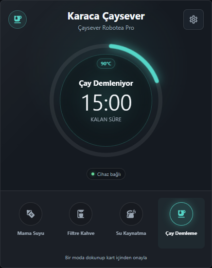
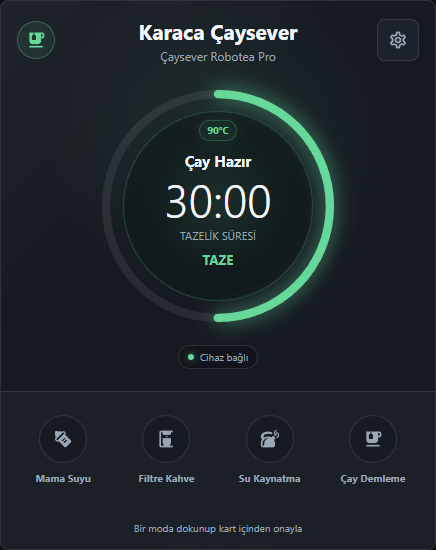
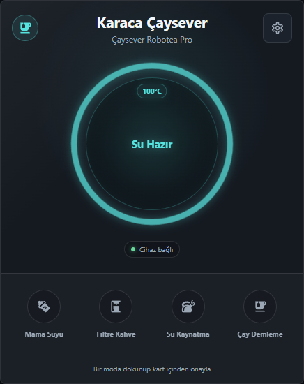
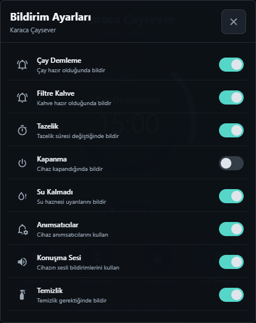

# Karaca Connect for Home Assistant

[](https://github.com/hacs/integration)
[](https://www.home-assistant.io/)
[](https://github.com/yunusuztr/karaca-connect-ha/releases)

Karaca Çaysever Robotea Pro Connect 4in1 cihazlarını Home Assistant'a bağlayan, cihaz durumlarını ve ayarlarını sunan resmi olmayan topluluk entegrasyonu.

Unofficial community integration for connecting Karaca Çaysever Robotea Pro Connect 4in1 devices to Home Assistant.

**Gereksinim / Requirement:** Home Assistant `2024.8.0` veya üzeri.

> Bu proje Karaca ile bağlantılı değildir; Karaca tarafından geliştirilmemiş, desteklenmemiş veya onaylanmamıştır.
>
> This project is not affiliated with, endorsed by, supported by, or maintained by Karaca.

## Karaca Connect Card

Sürüm `1.0.7` ile entegrasyona cihaz için özel olarak tasarlanmış bir Lovelace kartı eklendi. Kart, seçilen Karaca cihazının entity'lerini otomatik keşfeder.

<table>
  <tr>
    <td></td>
    <td></td>
  </tr>
  <tr>
    <td align="center"><strong>Çay demleniyor</strong></td>
    <td align="center"><strong>Çay hazır ve taze</strong></td>
  </tr>
</table>

<table>
  <tr>
    <td></td>
    <td></td>
  </tr>
  <tr>
    <td align="center"><strong>Su hazır</strong></td>
    <td align="center"><strong>Bildirim ayarları</strong></td>
  </tr>
</table>

### Kart Özellikleri

- Mama suyu, filtre kahve, su kaynatma ve çay demleme kontrolleri.
- Yanlış dokunmaları önlemek için basılı tutma veya kart içi onay seçeneği.
- Çalışan mod için akıcı halka animasyonu.
- Su ve mama suyu hazır olduğunda tam dolu, yumuşak parlayan halka.
- Çay için 15 dakikalık demleme ve 60 dakikalık tazelik göstergesi.
- Filtre kahve için 2 dakikalık demleme ve 40 dakikalık tazelik göstergesi.
- Hedef sıcaklık bilgileri: mama suyu `40°C`, çay `90°C`, filtre kahve `90°C`, su kaynatma `100°C`.
- Taze ve bayat durumları için renkli durum göstergeleri.
- Cihaz bildirimleri, anımsatıcılar, konuşma sesi ve temizlik ayarları için kart içi panel.
- Bağlantı, hata ve komut zaman aşımı durumları için görünür uyarılar.
- Mobil ve masaüstü ekranlara uyumlu responsive tasarım.

Karttaki yerel sayaçlar görsel yardımcıdır. Karaca API'den gelen cihaz durumu her zaman önceliklidir.

## Entegrasyon Özellikleri

- Home Assistant arayüzünden e-posta ve şifre ile kurulum.
- Hesapta birden fazla desteklenen cihaz varsa cihaz seçimi.
- Su kaynatma, çay demleme, filtre kahve ve mama suyu için ayrı mod switch'leri.
- Aktif mod, cihaz durumu ve çay tazeliği sensörleri.
- Otomasyon editöründe seçilebilir sabit enum durumları.
- Su yok, hedef sıcaklık uygun değil, temizlik gerekli ve genel cihaz hatalarının eşlenmesi.
- Çay, filtre kahve, tazelik, kapanma, su kalmadı, anımsatıcı, konuşma sesi ve temizlik ayarları.
- Ayarlanabilir güncelleme aralığı ve hata gösterim süresi.
- Komut sonrasında hızlı durum yenilemesi.
- Token yenileme ve yeniden kimlik doğrulama.
- Türkçe ve İngilizce dil desteği.
- Home Assistant diagnostics desteği.

## Kurulum

### HACS

1. HACS arayüzünde sağ üst menüden **Custom repositories** bölümünü açın.
2. `https://github.com/yunusuztr/karaca-connect-ha` adresini ekleyin.
3. Kategori olarak **Integration** seçin.
4. **Karaca Connect** entegrasyonunu indirin.
5. Home Assistant'ı yeniden başlatın.
6. **Ayarlar > Cihazlar ve Hizmetler > Entegrasyon Ekle** bölümünden **Karaca Connect** aratın.
7. Karaca Connect hesabınızla giriş yapıp cihazınızı seçin.

## Kart Kurulumu

Entegrasyon kart dosyasını Home Assistant üzerinden sunar. Lovelace kaynağını bir kez eklemek gerekir:

1. **Ayarlar > Panolar** bölümünü açın.
2. Sağ üst menüden **Kaynaklar** bölümüne girin.
3. Yeni JavaScript modülü ekleyin:

```text
/karaca-connect-card.js?v=1.0.7
```

4. Kaynak türünü **JavaScript Module** seçin.
5. Dashboard'u yenileyin.
6. Kart ekleme ekranından **Karaca Connect Card** seçin.
7. Görsel editörden Karaca cihazınızı ve onay yöntemini seçin.

### YAML Kullanımı

```yaml
type: custom:karaca-connect-card
device_id: KARACA_DEVICE_ID
name: Karaca Çaysever
confirm_type: hold
show_freshness: true
animation: true
```

`device_id` değerini elle yazmak yerine kartın görsel editöründen cihaz seçmeniz önerilir.

## Örnek Otomasyon

```yaml
alias: "Karaca: Su Hazır Bildirimi"
triggers:
  - trigger: state
    entity_id: sensor.cay_makinesi_durumu
    from: "Su Kaynatılıyor"
    to: "Su Hazır"
actions:
  - action: notify.notify
    data:
      title: "Karaca Çaysever"
      message: "Su hazır. Çayı demleyebilirsiniz."
mode: single
```

Entity kimliği, kurulum sırasında seçtiğiniz ad ön ekine göre değişebilir.

## English

Karaca Connect exposes supported tea-maker modes, device status, freshness, notification settings, authentication recovery, and diagnostics in Home Assistant.

Version `1.0.7` also bundles a dedicated responsive Lovelace card. The card discovers entities from the selected Karaca device, provides guarded mode controls, displays brewing/freshness timers, and includes a settings panel.

### Installation

1. Add `https://github.com/yunusuztr/karaca-connect-ha` to HACS as an **Integration** custom repository.
2. Install **Karaca Connect** and restart Home Assistant.
3. Add the integration from **Settings > Devices & Services**.
4. Add `/karaca-connect-card.js?v=1.0.7` as a **JavaScript Module** dashboard resource.
5. Add **Karaca Connect Card** to a dashboard and select your device in the visual editor.

## Version 1.0.7

- Added the dedicated Karaca Connect Lovelace card.
- Added device-based automatic entity discovery metadata.
- Added tea and coffee brewing/freshness presentations.
- Added water and baby-water ready animations.
- Added target-temperature badges and device settings panel.
- Added responsive visual editor and guarded mode controls.

## License and Disclaimer

This is an unofficial, community-driven custom integration. Product names, logos, and brands belong to their respective owners. Karaca Connect cloud API changes may affect functionality. Use this integration at your own risk.
